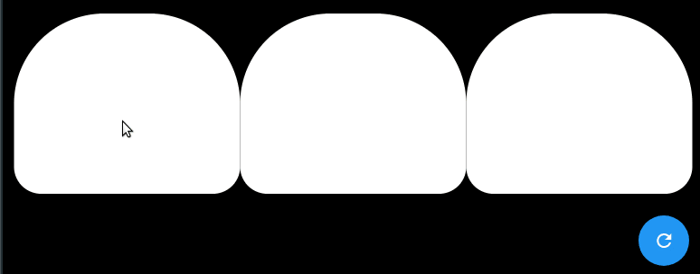

# Provider MVC Example App

## Bulbs App

The app consist of 3 bulbs every time a bulb clicked its state will be toggled between (ON/OFF) and if all bulbs are ON the bg color will be light otherwise it’s dark. The app has also a fab once clicked it toggle every bulb state.

### Getting Started

For web running use: flutter run -d chrome
