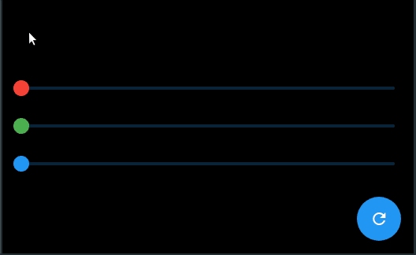

# Provider MVC Example App

## BG Color App

The app contains 3 sliders each one represent a primary color (Red/Green/Blue) and every time a slider value changed the background color should reflect the sliders colors merge. Also the app has a reset fab.

### Getting Started

For web running use: flutter run -d chrome
