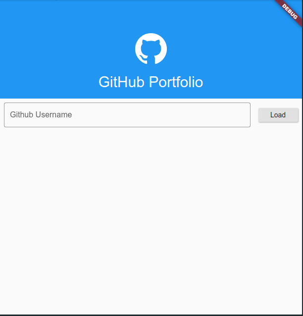

# Provider MVC Example App

## Portfolio App

The app show profile informations and projects list of the introduced github user name.

### Getting Started

For web running use: flutter run -d chrome
